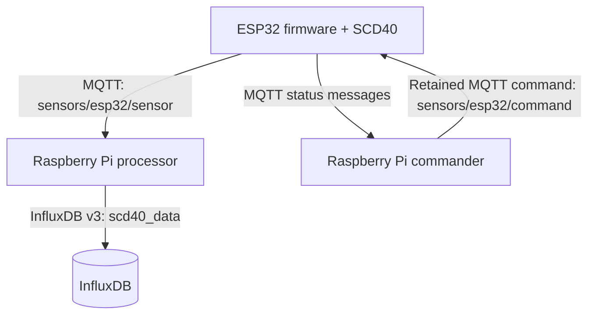

# Air Quality Project

Rust workspace for an ESP32-based air-quality monitor. An ESP32 connected to a Sensirion SCD40 wakes from deep sleep, connects to Wi-Fi, checks MQTT for a command, then either performs that command or records a CO₂/temperature/humidity measurement. Measurement and status messages are sent over MQTT; a Raspberry Pi service persists measurements to InfluxDB and can mark anomalies in historical data.



## Workspace crates

| Crate | Role |
| --- | --- |
| [`esp32-firmware`](./esp32-firmware) | Firmware for an ESP32-S/NodeMCU with an SCD40 sensor. Uses I²C GPIO21 (SDA) and GPIO22 (SCL), and GPIO2 as a status LED. It persists the deep-sleep duration in ESP NVS. |
| [`rpi-processor`](./rpi-processor) | Receives MQTT measurements, writes valid readings to InfluxDB v3, and analyzes historical data to create anomaly records. |
| [`rpi-commander`](./rpi-commander) | Interactive MQTT command-line client for the ESP32. It also displays device messages. |
| [`shared-types`](./shared-types) | Shared Serde types defining the JSON message envelope, sensor/status payloads, and device commands. |

## MQTT contract

| Direction | Topic | Payload |
| --- | --- | --- |
| ESP32 → consumers | `sensors/esp32/sensor` | A JSON `DeviceMessage`: device ID plus a measurement or status payload. |
| Commander → ESP32 | `sensors/esp32/command` | A JSON `DeviceCommand`, sent retained with QoS 1. |

The firmware currently uses the fixed device ID `esp32-scd40` and the fixed topic names above. After receiving a non-noop command, it clears the retained command. It waits up to one second for a command after connecting; otherwise it takes a measurement.

## ESP32 firmware

The firmware performs one cycle per boot:

1. initializes the SCD40 and reads the configured sleep interval from NVS;
2. joins Wi-Fi and connects to MQTT;
3. waits for a command or performs a normal measurement;
4. publishes a result/status message;
5. shuts down peripherals and deep-sleeps.

The default deep-sleep interval is 300 seconds. Normal SCD40 readings wait for data for up to 15 seconds. Forced recalibration (FRC) warms the sensor for three minutes before calibration.

### Configuration

Create `esp32-firmware/.env`:

```dotenv
WIFI_SSID=your-wifi-name
WIFI_PASSWORD=your-wifi-password
MQTT_BROKER_URL=mqtt://broker-host:1883
```

`build.rs` embeds these values when building the firmware; do not commit this file. The ESP32 must be able to reach the MQTT broker.

### Build, flash, and monitor

From the firmware directory:

```sh
cd esp32-firmware
cargo run
```

Its Cargo configuration targets `xtensa-esp32-espidf` and uses `espflash flash --monitor` as the runner. For ESP Rust installation and target setup, use the official documentation: <https://docs.espressif.com/projects/rust/book/getting-started/index.html>.

## Raspberry Pi processor

The processor requires InfluxDB v3-compatible endpoints. Live measurements are written to `scd40_data`, with a `device` tag and `co2_ppm`, `temperature_c`, and `humidity_percent` fields.

Create a `.env` in the directory where you run the processor:

```dotenv
INFLUXDB_URL=https://your-influx-host
INFLUXDB_TOKEN=your-token
INFLUXDB_DATABASE=your-database

# Optional MQTT settings
MQTT_BROKER_HOST=localhost
MQTT_BROKER_PORT=1883
MQTT_CLIENT_ID=raspberry-pi-receiver
MQTT_TOPIC=sensors/esp32/sensor
```

The InfluxDB variables are required even when running a mode that does not write measurements.

```sh
# Subscribe continuously and save successful measurement payloads to scd40_data.
cargo run -p rpi-processor -- --receive-live-data

# Analyze all scd40_data records and write flags to the anomalies measurement.
cargo run -p rpi-processor -- --mark-historical-data

# Delete every InfluxDB table with a name beginning with "anomalies".
cargo run -p rpi-processor -- --delete-old-markings

# Evaluate a matrix of detector thresholds and write results to anomalies_v3_* measurements.
cargo run -p rpi-processor -- --mark-anomalies-test
```

Historical analysis currently flags CO₂ at or above 700 ppm, very low humidity, and low-humidity/temperature-rise patterns that may indicate direct sunlight. The parameter-matrix command writes multiple `anomalies_v3_*` tables; remove them with `--delete-old-markings` when no longer needed.

## Raspberry Pi commander

Create a `.env` in the directory where you run the commander, if the defaults do not match your broker:

```dotenv
MQTT_BROKER_HOST=localhost
MQTT_BROKER_PORT=1883
MQTT_CLIENT_ID=raspberry-pi-commander
DEFAULT_DEVICE=esp32-scd40
```

Start the interactive client:

```sh
cargo run -p rpi-commander
```

Available commands:

```text
noop
frc [ppm]                 # defaults to 422 ppm
set-offset <degrees-c>
get-offset
set-sleep <seconds>
get-sleep
device <name>
status
help
exit
```

`device <name>` changes the name shown by the CLI, but does not change the MQTT command topic; the current firmware therefore still receives commands only on `sensors/esp32/command`.

## Shared message types

`shared-types` provides the Serde-compatible protocol used by all executables. Measurements use the following JSON shape:

```json
{
  "device": "esp32-scd40",
  "status": "success",
  "co2": 450,
  "temperature": 22.0,
  "humidity": 45.3
}
```

Commands are tagged with `cmd`, for example:

```json
{"cmd":"start_frc","target_ppm":420}
```

Run its unit tests with:

```sh
cargo test -p shared-types
```
